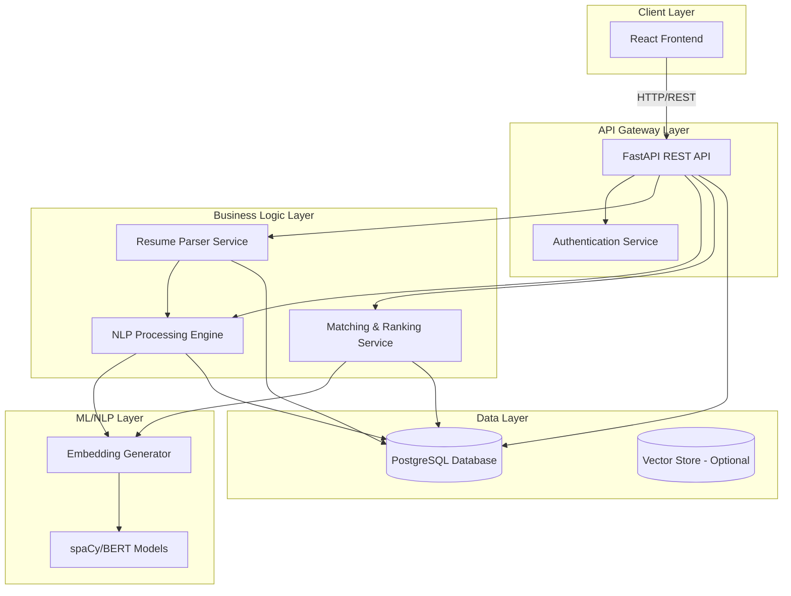

# Resume Screening & Job Matching AI - High-Level Design

## Architecture Overview

This document outlines the scalable, layered architecture for a Resume Screening & Job Matching AI system that processes resumes, extracts information, and matches candidates with job descriptions using NLP and ML techniques.

## System Architecture Diagram

## Layer Structure

### 1. **Presentation Layer** (`frontend/`)

- **Technology**: React with TypeScript
- **Responsibilities**:
  - User interface for uploading resumes
  - Job description input/management
  - Candidate matching results visualization
  - Ranking display with scores
  - User authentication UI
- **Key Components**:
  - Resume upload component
  - Job posting form
  - Matching dashboard
  - Candidate ranking table
  - Authentication forms

### 2. **API Gateway Layer** (`backend/api/`)

- **Technology**: FastAPI (Python)
- **Responsibilities**:
  - RESTful API endpoints
  - Request/response validation
  - Authentication & authorization (JWT)
  - Rate limiting
  - CORS handling
  - API documentation (Swagger/OpenAPI)
- **Key Endpoints**:
  - `POST /api/auth/login` - User authentication
  - `POST /api/resumes/upload` - Resume upload
  - `GET /api/resumes/{id}` - Get resume details
  - `POST /api/jobs` - Create job posting
  - `POST /api/jobs/{job_id}/match` - Match candidates
  - `GET /api/jobs/{job_id}/rankings` - Get ranked candidates

### 3. **Business Logic Layer** (`backend/services/`)

#### 3.1 Resume Parser Service (`resume_parser.py`)

- **Responsibilities**:
  - Parse PDF/DOCX files
  - Extract raw text content
  - Structure extraction (sections identification)
- **Dependencies**: `pdfplumber`, `python-docx`, `pypandoc`

#### 3.2 NLP Processing Engine (`nlp_engine.py`)

- **Responsibilities**:
  - Extract skills using NER (Named Entity Recognition)
  - Extract experience (dates, companies, roles)
  - Extract education (degrees, institutions, years)
  - Text preprocessing and normalization
- **Dependencies**: `spaCy`, custom NER models

#### 3.3 Matching & Ranking Service (`matching_service.py`)

- **Responsibilities**:
  - Generate embeddings for resumes and job descriptions
  - Calculate similarity scores (cosine similarity)
  - Rank candidates based on multiple factors:
    - Skill match percentage
    - Experience relevance
    - Education alignment
    - Overall semantic similarity
  - Weighted scoring algorithm
- **Dependencies**: `sentence-transformers`, `scikit-learn`

### 4. **Data Access Layer** (`backend/database/`)

- **Technology**: PostgreSQL with SQLAlchemy ORM
- **Responsibilities**:
  - Database models and schemas
  - CRUD operations
  - Query optimization
  - Database migrations (Alembic)
- **Key Models**: