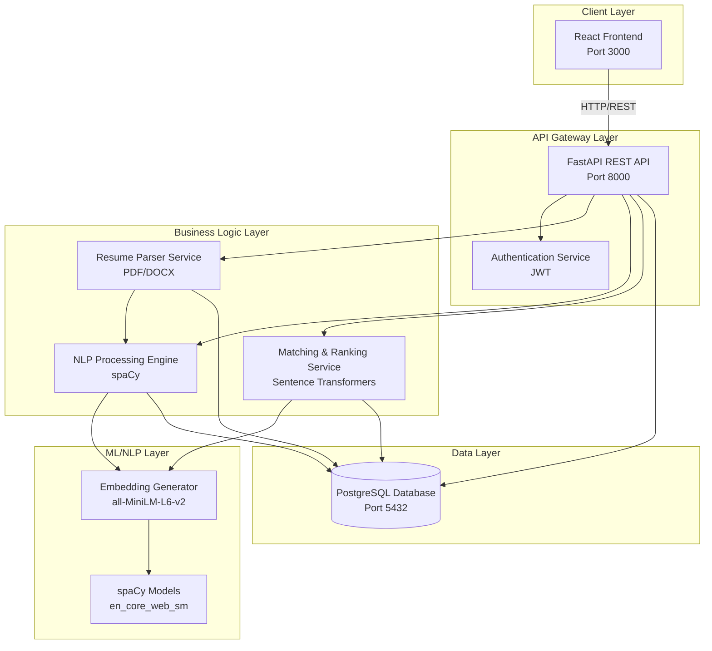
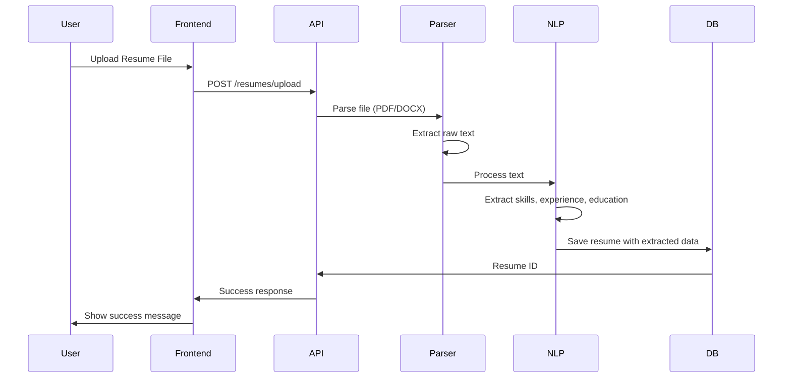
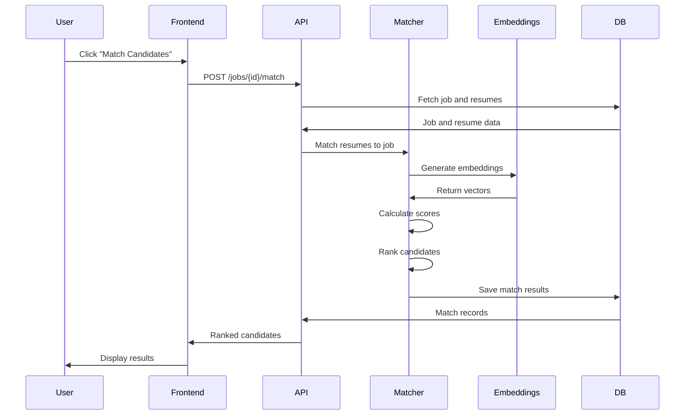
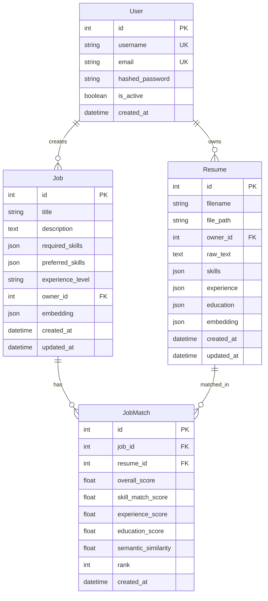

# Resume Screening & Job Matching AI - High-Level Design (HLD)

## Table of Contents
1. [Architecture Overview](#architecture-overview)
2. [System Architecture Diagram](#system-architecture-diagram)
3. [Layer Structure](#layer-structure)
4. [Technology Stack](#technology-stack)
5. [Data Flow](#data-flow)
6. [Database Schema](#database-schema)
7. [API Design](#api-design)
8. [Scalability Considerations](#scalability-considerations)
9. [Deployment Architecture](#deployment-architecture)

## Architecture Overview

This document outlines the scalable, layered architecture for a Resume Screening & Job Matching AI system. The system processes resumes (PDF/DOCX), extracts candidate information using NLP, and matches candidates with job descriptions using advanced ML techniques.

### Key Features
- **Resume Parsing**: Supports PDF and DOCX formats
- **Information Extraction**: Automatically extracts skills, experience, and education using NLP
- **Smart Matching**: Uses BERT embeddings and semantic similarity for candidate-job matching
- **Ranking System**: Automatically ranks candidates based on multiple weighted factors
- **Authentication**: Secure JWT-based authentication
- **Scalable Architecture**: Docker-based deployment with PostgreSQL

## System Architecture Diagram



## Layer Structure

### 1. **Presentation Layer** (`frontend/`)

**Technology**: React 18 with JavaScript

**Responsibilities**:
- User interface for uploading resumes
- Job description input/management
- Candidate matching results visualization
- Ranking display with scores
- User authentication UI

**Key Components**:
- `Login.js` - User authentication
- `Register.js` - User registration
- `Dashboard.js` - Main dashboard with tabs
- `ResumeUpload.js` - Resume file upload component
- `ResumeList.js` - Display uploaded resumes
- `JobForm.js` - Create job postings
- `JobList.js` - Display job postings
- `MatchResults.js` - Display matching results and rankings

**File Structure**:
```
frontend/
├── src/
│   ├── components/       # React components
│   ├── services/         # API service calls
│   ├── App.js            # Main app component
│   └── index.js          # Entry point
├── public/               # Static files
├── package.json          # Dependencies
└── Dockerfile            # Frontend container config
```

### 2. **API Gateway Layer** (`backend/api/`)

**Technology**: FastAPI (Python 3.11)

**Responsibilities**:
- RESTful API endpoints
- Request/response validation using Pydantic
- Authentication & authorization (JWT)
- CORS handling
- API documentation (Swagger/OpenAPI)
- Error handling

**Key Endpoints**:

**Authentication** (`/api/v1/auth/`):
- `POST /register` - User registration
- `POST /login` - User authentication (returns JWT token)

**Resumes** (`/api/v1/resumes/`):
- `POST /upload` - Upload and process resume file
- `GET /` - Get all resumes for current user
- `GET /{id}` - Get specific resume details
- `DELETE /{id}` - Delete a resume

**Jobs** (`/api/v1/jobs/`):
- `POST /` - Create job posting
- `GET /` - Get all jobs for current user
- `GET /{id}` - Get specific job details
- `POST /{id}/match` - Match candidates with job
- `GET /{id}/rankings` - Get ranked candidates for job
- `DELETE /{id}` - Delete a job posting

**File Structure**:
```
backend/
├── api/
│   ├── auth.py           # Authentication endpoints
│   ├── resumes.py        # Resume endpoints
│   └── jobs.py           # Job endpoints
├── main.py               # FastAPI application entry
└── Dockerfile            # Backend container config
```

### 3. **Business Logic Layer** (`backend/services/`)

This layer contains the core business logic separated into specialized services.

#### 3.1 Resume Parser Service (`services/resume_parser.py`)

**Responsibilities**:
- Parse PDF files using `pdfplumber`
- Parse DOCX files using `python-docx`
- Extract raw text content
- Identify resume sections (summary, experience, education, skills)

**Dependencies**: `pdfplumber`, `python-docx`

**Key Methods**:
- `parse(file_path)` - Parse resume file and extract text
- `identify_sections(text)` - Identify common resume sections

#### 3.2 NLP Processing Engine (`services/nlp_engine.py`)

**Responsibilities**:
- Extract skills using keyword matching and NER (Named Entity Recognition)
- Extract experience (dates, companies, roles) using regex and NLP
- Extract education (degrees, institutions, years) using pattern matching
- Text preprocessing and normalization

**Dependencies**: `spaCy` with `en_core_web_sm` model

**Key Methods**:
- `extract_skills(text)` - Extract skills from resume text
- `extract_experience(text)` - Extract work experience entries
- `extract_education(text)` - Extract education information
- `process_resume(text)` - Process resume and extract all information

#### 3.3 Matching & Ranking Service (`services/matching_service.py`)

**Responsibilities**:
- Generate embeddings for resumes and job descriptions using Sentence Transformers
- Calculate similarity scores (cosine similarity)
- Rank candidates based on multiple factors:
  - Skill match percentage (30% weight)
  - Experience relevance (20% weight)
  - Education alignment (10% weight)
  - Overall semantic similarity (40% weight)
- Weighted scoring algorithm

**Dependencies**: `sentence-transformers` (all-MiniLM-L6-v2), `scikit-learn`

**Key Methods**:
- `generate_embedding(text)` - Generate embedding vector
- `calculate_semantic_similarity(emb1, emb2)` - Calculate cosine similarity
- `calculate_skill_match_score(resume_skills, job_skills)` - Calculate skill matching
- `calculate_experience_score(experience, level)` - Calculate experience score
- `calculate_education_score(education)` - Calculate education score
- `calculate_overall_score(...)` - Calculate weighted overall score
- `match_resume_to_job(...)` - Complete matching process

**File Structure**:
```
backend/
├── services/
│   ├── resume_parser.py      # Resume parsing service
│   ├── nlp_engine.py         # NLP processing service
│   └── matching_service.py   # Matching and ranking service
```

### 4. **Data Access Layer** (`backend/database/`)

**Technology**: PostgreSQL with SQLAlchemy ORM

**Responsibilities**:
- Database models and schemas
- CRUD operations
- Database session management
- Database initialization

**Key Models**:

**User**:
- `id` (Primary Key)
- `username` (Unique)
- `email` (Unique)
- `hashed_password`
- `is_active`
- `created_at`

**Resume**:
- `id` (Primary Key)
- `filename`
- `file_path`
- `owner_id` (Foreign Key → User)
- `raw_text`
- `skills` (JSON)
- `experience` (JSON)
- `education` (JSON)
- `embedding` (JSON - vector)
- `created_at`, `updated_at`

**Job**:
- `id` (Primary Key)
- `title`
- `description`
- `required_skills` (JSON)
- `preferred_skills` (JSON)
- `experience_level`
- `owner_id` (Foreign Key → User)
- `embedding` (JSON - vector)
- `created_at`, `updated_at`

**JobMatch**:
- `id` (Primary Key)
- `job_id` (Foreign Key → Job)
- `resume_id` (Foreign Key → Resume)
- `overall_score`
- `skill_match_score`
- `experience_score`
- `education_score`
- `semantic_similarity`
- `rank`
- `created_at`

**File Structure**:
```
backend/
├── database/
│   ├── models.py          # SQLAlchemy models
│   └── session.py         # Database session management
```

### 5. **Core Configuration Layer** (`backend/core/`)

**Responsibilities**:
- Application configuration (settings)
- Security utilities (password hashing, JWT)
- Environment variable management

**Key Files**:
- `config.py` - Application settings using Pydantic
- `security.py` - Authentication and security utilities

## Technology Stack

### Backend
- **Framework**: FastAPI 0.104.1
- **Language**: Python 3.11
- **Database**: PostgreSQL 15
- **ORM**: SQLAlchemy 2.0
- **Authentication**: JWT (python-jose)
- **Password Hashing**: bcrypt (passlib)

### NLP/ML
- **NLP Library**: spaCy 3.7.2
- **Model**: en_core_web_sm
- **Embeddings**: sentence-transformers 2.2.2
- **Model**: all-MiniLM-L6-v2
- **ML Utilities**: scikit-learn 1.3.2

### File Processing
- **PDF**: pdfplumber 0.10.3
- **DOCX**: python-docx 1.1.0

### Frontend
- **Framework**: React 18.2.0
- **Routing**: React Router DOM 6.20.0
- **HTTP Client**: Axios 1.6.2

### Deployment
- **Containerization**: Docker, Docker Compose
- **Web Server**: Uvicorn (ASGI)

## Data Flow

### Resume Upload Flow



### Job Matching Flow



## Database Schema



## API Design

### Authentication Flow

1. **Registration**: `POST /api/v1/auth/register`
   - Request: `{username, email, password}`
   - Response: `{id, username, email, created_at}`

2. **Login**: `POST /api/v1/auth/login`
   - Request: Form data `{username, password}`
   - Response: `{access_token, token_type}`

### Resume Management

1. **Upload Resume**: `POST /api/v1/resumes/upload`
   - Request: Multipart form data with file
   - Response: `{id, filename, message}`

2. **Get Resumes**: `GET /api/v1/resumes`
   - Response: `[{id, filename, skills, experience, education, ...}]`

### Job Management

1. **Create Job**: `POST /api/v1/jobs`
   - Request: `{title, description, required_skills, preferred_skills, experience_level}`
   - Response: `{id, title, description, ...}`

2. **Match Candidates**: `POST /api/v1/jobs/{job_id}/match`
   - Request: `{resume_ids: [optional]}`
   - Response: `{job_id, job_title, matches: [...], total_matched}`

## Scalability Considerations

### Current Architecture (Prototype)

The current implementation is designed as a working prototype with scalability in mind:

1. **Stateless API**: FastAPI is stateless, allowing horizontal scaling
2. **Database Connection Pooling**: SQLAlchemy uses connection pooling
3. **Docker Containerization**: Easy to scale individual services
4. **Separation of Concerns**: Clear layer separation allows independent scaling

### Scalability Improvements (Production)

#### 1. **Caching Layer**
- Add Redis for caching embeddings and match results
- Cache frequently accessed resumes and jobs
- Reduce database load

#### 2. **Message Queue**
- Use RabbitMQ or Apache Kafka for async processing
- Queue resume parsing and matching tasks
- Handle high-volume uploads

#### 3. **Vector Database**
- Migrate embeddings to specialized vector DB (Pinecone, Weaviate, Qdrant)
- Enable fast similarity search at scale
- Support millions of resumes

#### 4. **Load Balancing**
- Add Nginx or HAProxy for load balancing
- Distribute requests across multiple API instances
- Health checks and failover

#### 5. **Database Optimization**
- Add database indexes on frequently queried fields
- Implement read replicas for read-heavy operations
- Partition large tables (resumes, matches)

#### 6. **Microservices Architecture**
- Split into separate services:
  - Resume Processing Service
  - Matching Service
  - User Service
  - Job Service
- Independent scaling per service

#### 7. **CDN and Static Assets**
- Serve frontend through CDN
- Cache static assets
- Reduce server load

#### 8. **Monitoring and Logging**
- Add Prometheus for metrics
- ELK stack for centralized logging
- Distributed tracing (Jaeger)

## Deployment Architecture

### Development (Docker Compose)

```
┌─────────────────┐
│   React App     │ Port 3000
└────────┬────────┘
         │ HTTP
┌────────▼────────┐
│   FastAPI       │ Port 8000
└────────┬────────┘
         │ SQL
┌────────▼────────┐
│  PostgreSQL     │ Port 5432
└─────────────────┘
```

### Production (Scalable)

```
                    ┌─────────────┐
                    │   Nginx     │
                    │ Load Balancer│
                    └──────┬──────┘
                           │
        ┌──────────────────┼──────────────────┐
        │                  │                  │
┌───────▼──────┐  ┌────────▼───────┐  ┌──────▼──────┐
│ FastAPI      │  │ FastAPI        │  │ FastAPI     │
│ Instance 1   │  │ Instance 2     │  │ Instance N  │
└───────┬──────┘  └────────┬───────┘  └──────┬──────┘
        │                  │                  │
        └──────────────────┼──────────────────┘
                           │
        ┌──────────────────┼──────────────────┐
        │                  │                  │
┌───────▼──────┐  ┌────────▼───────┐  ┌──────▼──────┐
│ PostgreSQL   │  │ Redis Cache    │  │ Vector DB   │
│ Primary      │  │                │  │ (Optional)  │
└──────────────┘  └────────────────┘  └─────────────┘
```

## File Structure

```
resume_screening/
├── backend/
│   ├── api/                    # API routes
│   │   ├── auth.py
│   │   ├── resumes.py
│   │   └── jobs.py
│   ├── core/                   # Core configuration
│   │   ├── config.py
│   │   └── security.py
│   ├── database/               # Database layer
│   │   ├── models.py
│   │   └── session.py
│   ├── services/               # Business logic
│   │   ├── resume_parser.py
│   │   ├── nlp_engine.py
│   │   └── matching_service.py
│   ├── schemas/                # Pydantic schemas
│   │   ├── user.py
│   │   ├── resume.py
│   │   └── job.py
│   ├── main.py                 # FastAPI app entry
│   └── Dockerfile
├── frontend/
│   ├── src/
│   │   ├── components/         # React components
│   │   ├── services/           # API services
│   │   ├── App.js
│   │   └── index.js
│   ├── public/
│   ├── package.json
│   └── Dockerfile
├── uploads/                    # Uploaded files (gitignored)
├── docker-compose.yml          # Docker orchestration
├── requirements.txt            # Python dependencies
├── env.example                 # Environment variables template
├── README.md                   # Project README
└── HLD.README.md              # This file
```

## Security Considerations

1. **Authentication**: JWT tokens with expiration
2. **Password Security**: bcrypt hashing
3. **File Upload**: File type validation, size limits
4. **SQL Injection**: SQLAlchemy ORM prevents SQL injection
5. **CORS**: Configured for specific origins
6. **Environment Variables**: Sensitive data in .env files

## Performance Considerations

1. **Embedding Caching**: Store embeddings in database to avoid recomputation
2. **Batch Processing**: Process multiple resumes in batches
3. **Async Operations**: Use async/await for I/O operations
4. **Database Indexing**: Index on foreign keys and frequently queried fields
5. **Connection Pooling**: SQLAlchemy connection pooling

## Future Enhancements

1. **Advanced NLP**: Fine-tune BERT models for resume parsing
2. **Multi-language Support**: Support resumes in multiple languages
3. **Resume Templates**: Support different resume formats
4. **Interview Scheduling**: Integrate calendar for interviews
5. **Email Notifications**: Notify candidates about matches
6. **Analytics Dashboard**: Track matching statistics
7. **A/B Testing**: Test different matching algorithms
8. **Machine Learning Pipeline**: Continuous model improvement

---

**Document Version**: 1.0  
**Last Updated**: 2024  
**Maintained By**: Development Team
